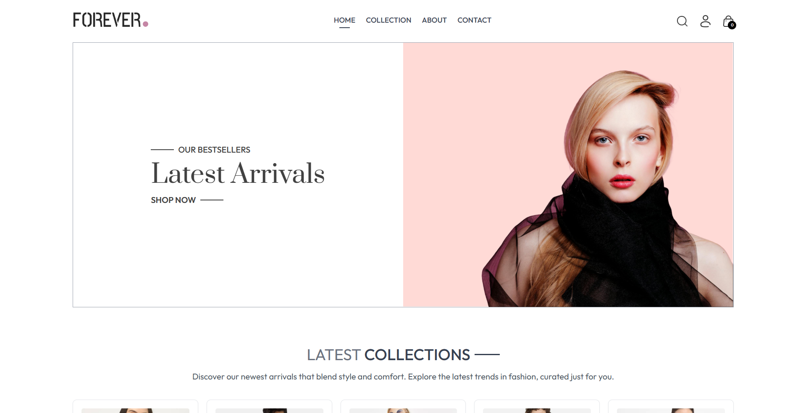
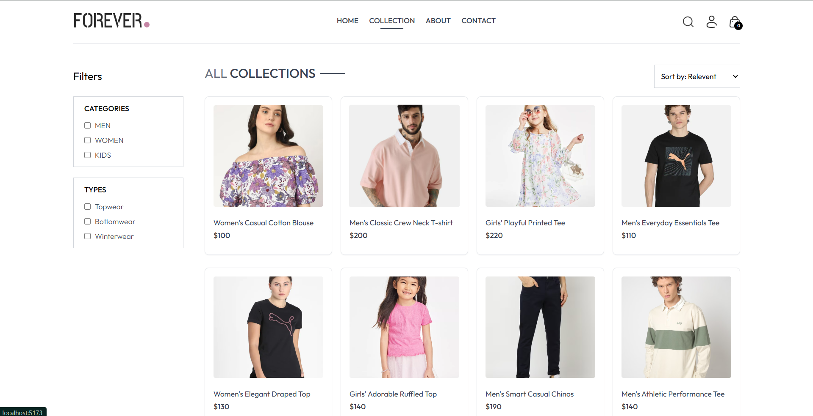
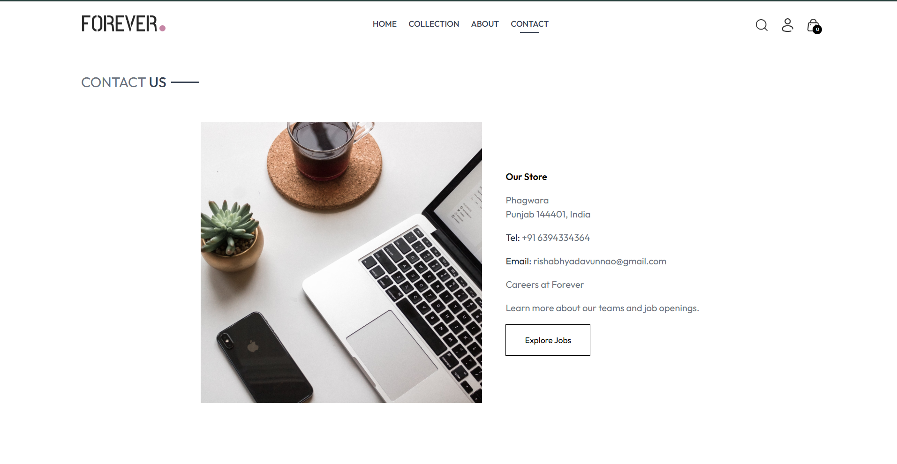

# Ecommerce-website  
_A simple clothes e-commerce website_

## Table of Contents  
- [About](#about)  
- [Features](#features)  
- [Demo / Screenshots](#demo--screenshots)  
- [Tech Stack](#tech-stack)  
- [Getting Started](#getting-started)  
- [Folder Structure](#folder-structure)  
- [Contributing](#contributing)  
- [License](#license)  
- [Contact](#contact)  

---

## About  
This project is a responsive **clothing e-commerce website** built with modern frontend tools. It includes a homepage, collection pages, a cart, user authentication stubs, and mobile navigation support.

---

## Features  
- Responsive layout for desktop and mobile devices  
- Navigation bar with search, profile icon, cart badge & mobile sidebar menu  
- Collection listing of products  
- Add to cart and display cart item count  
- User login (UI placeholder)  
- Clean UI built using utility-first CSS  

---

## Demo / Screenshots  
> Add screenshots or GIFs of your website here  



e

---

## Tech Stack  
- **Frontend**: React + React Router DOM  
- **Styling**: Tailwind CSS  
- **Build Tool**: Vite  
- **State Management**: React Context API (ShopContext)  
- **Icons / Assets**: Local asset imports (logo, search icon, profile icon, cart icon, menu icon)  

---

## Getting Started  

### Prerequisites  
Make sure you have the following installed:  
- Node.js (version 14 or above recommended)  
- npm or yarn  

### Installation  
1. Clone the repository  
   ```bash  
   git clone https://github.com/rishabh-ydv23/Ecommerce-website-.git  
   cd Ecommerce-website-  
Install dependencies


npm install  
# or  
yarn install  
Run the development server


npm run dev  
# or  
yarn dev  
Open your browser to http://localhost:3000 (or the URL shown in the terminal)

Folder Structure
Here is a simplified view of the project structure:


📦 Ecommerce-website-  
└─ src/  
   ├─ assets/        ← images & icons  
   ├─ Components/    ← reusable React components  
   │    └─ Navbar.jsx  
   ├─ Context/       ← React Context for state (ShopContext)  
   ├─ Pages/         ← Page components (Home, Collection, About, Contact, etc)  
   └─ App.jsx        ← Application root & Router setup  
# Contribution:
```
Fork the repo

Create a new branch (git checkout -b feature/YourFeature)

Make your changes & test locally

Commit your changes (git commit -m "Add feature X")

Push to your fork (git push origin feature/YourFeature)

Open a Pull Request here on GitHub

License
This project is open-source and available under the MIT License (include LICENSE file).

Contact
Created by Rishabh – feel free to connect with me:

GitHub: @rishabh-ydv23

Email: rishabhyadavunnao@gmail.com
```
